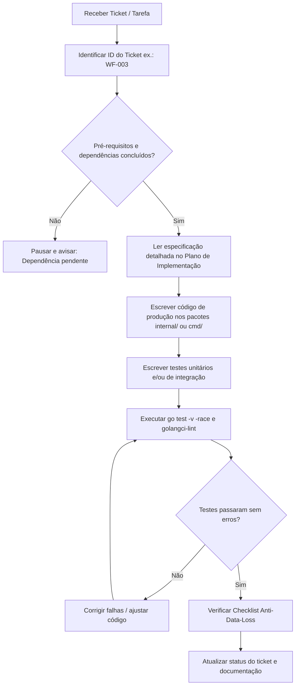
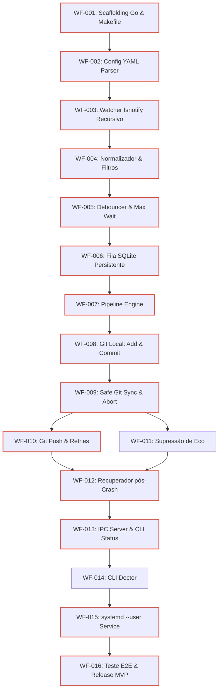

# Guia Operacional para Agentes de IA — WatchFlow (AGENTS.md)

**Versão:** 1.0.0  
**Status:** Vigente / Canônico  
**Documentos de Referência:**
* [Plano de Implementação - WatchFlow.md](file:///home/caio/GDrive/100%20-%20Projetos/WatchFlow/Plano%20de%20Implementa%C3%A7%C3%A3o%20-%20WatchFlow.md)
* [watchflow_prompt.md](file:///home/caio/GDrive/100%20-%20Projetos/WatchFlow/watchflow_prompt.md)

---

## 1. Missão do Agente e Propósito do Projeto

Este repositório contém o código-fonte e as especificações do **WatchFlow**, um daemon local reativo orientado a eventos de sistema de arquivos (*filesystem-driven automation daemon*).

### Propósito Central:
Fornecer **sincronização autônoma, bidirecional e estritamente segura de vaults de conhecimento (ex.: Obsidian) entre múltiplas máquinas via Git**, sem depender de plugins instalados no editor nem exigir intervenção manual do usuário para commits ou pushes.

### Princípios de Engenharia Fundamentais:
1. **Agnóstico a Aplicações (*Application-Agnostic*):** O sistema reage a eventos do kernel/filesystem; não sabe e não se importa se o arquivo foi modificado pelo Obsidian, VS Code, Codex CLI, script ou gerenciador de arquivos.
2. **Agnóstico a Provedores (*Provider-Agnostic*):** A camada de detecção e enfileiramento desconhece o destino final. O Git é o primeiro provedor implementado no MVP, mas o pipeline deve aceitar futuros adaptadores (WebDAV, S3, rsync, scripts).
3. **Preservação Absoluta de Dados (*Anti-Data-Loss*):** Sob nenhuma hipótese o daemon pode sobrescrever, descartar, forçar alterações (`push --force`) ou deixar a árvore de trabalho do usuário em estado quebrado/conflitante.
4. **Operação Offline-First:** Falhas de conectividade de rede não impedem commits locais nem apagam intenções de sincronização.
5. **YAGNI e Simplicidade Operacional:** Processo local único, binário estático compilado em Go, sem dependências externas de microsserviços, Redis ou Kafka.

---

## 2. Pipeline de Processamento Linear

Todo o fluxo de automação do WatchFlow respeita estritamente este ciclo:

$$\text{Kernel inotify} \longrightarrow \text{Watcher Engine} \longrightarrow \text{Normalizer \& Echo Filter} \longrightarrow \text{Debounce Window} \longrightarrow \text{Rule Engine} \longrightarrow \text{SQLite WAL Queue} \longrightarrow \text{Pipeline Engine} \longrightarrow \text{Action Provider (Git)}$$

1. **Watcher Engine:** Captura eventos brutos com recursividade dinâmica sobre novos diretórios criados.
2. **Normalizer & Echo Filter:** Converte para caminhos absolutos canônicos, descarta padrões ignorados (`.git/**`, `*.tmp`) e suprime ecos de arquivos alterados pelo próprio daemon.
3. **Debounce & Coalescer:** Agrupa rajadas rápidas de eventos de escrita usando janela deslizante (ex.: 15s) limitada por teto máximo (*max_wait*, ex.: 60s).
4. **Rule Engine:** Mapeia o conjunto de arquivos agrupados aos pipelines configurados.
5. **Job Queue (SQLite WAL):** Persiste o job atomicamente em disco antes de qualquer execução externa, suportando recuperação pós-crash.
6. **Pipeline Engine:** Executa sequencialmente os passos configurados com cancelamento por `context.Context`.
7. **Action Providers:** Executam ações atômicas idempotentes (ex.: `git.check_locks`, `git.add`, `git.commit`, `git.safe_sync`, `git.push`).

---

## 3. Diretrizes Inegociáveis de Segurança e Anti-Data-Loss

Qualquer agente implementando ou alterando código neste projeto DEVE seguir rigorosamente as regras abaixo. **A violação de qualquer um destes itens resulta na reprovação imediata do código.**

### 3.1. O Protocolo "Safe Git Sync" (Substituição Obrigatória ao `git pull --rebase`)
* **PROIBIDO:** Nunca executar `git pull --rebase` em automações desassistidas. O rebase pode travar em *detached HEAD* e pausar aguardando input interativo, bloqueando o repositório.
* **OBRIGATÓRIO:** Implementar e seguir o fluxo **Safe Git Sync**:
  1. Executar `git status --porcelain`. Se não houver alterações locais reais, pular `git add`/`git commit`.
  2. Se houver alterações locais, efetuar `git add -A` e `git commit -m "watchflow: auto-sync <timestamp>"` **ANTES** de qualquer tentativa de sincronização remota.
  3. Executar `git fetch origin <branch>`.
  4. Inspecionar o grafo de divergência (`git rev-list --left-right origin/<branch>...HEAD`).
  5. Se o remote não divergiu: efetuar `git push`.
  6. Se houve avanço limpo no remote: efetuar `git merge --ff-only origin/<branch>` e em seguida `git push`.
  7. Se houve commits paralelos sem conflito de linhas: efetuar `git merge --no-edit origin/<branch>` e em seguida `git push`.
  8. **Se houver qualquer conflito de merge:** Executar imediatamente `git merge --abort`. O worktree DEVE retornar ao estado intacto e limpo. Marcar o job como `BLOCKED`, o watcher como `CONFLICT_HALTED` e disparar notificação desktop ao usuário. **Jamais injetar marcadores de conflito (`<<<<<<< HEAD`) nos arquivos Markdown.**

### 3.2. Prevenção do Loop de Feedback (*Echo Suppression*)
* Ações do daemon que modificam arquivos (como `git pull`, `git merge`, `git checkout`) disparam eventos inotify no kernel.
* O componente `internal/normalizer/echo_suppressor.go` deve manter uma janela temporal em memória (hash/caminho do arquivo + timestamp de expiração de ~2s) para ignorar os eventos gerados pelas operações internas do próprio WatchFlow.

### 3.3. Travas de Concorrência e Respeito a Locks Externos
* **Process Lock:** O daemon mantém um Unix Domain Socket exclusivo em `/run/user/<UID>/watchflow.sock` (ou fallback no diretório de estado). Se outra instância for iniciada, ela deve falhar imediatamente.
* **External Git Lock:** O daemon **JAMAIS** remove arquivos `.git/index.lock` criados pelo usuário ou por outros programas (Obsidian Git, VS Code). Ele deve aguardar com backoff (até `max_wait_lock`, ex.: 10s). Se a trava persistir, o job falha com status transitório para retentativa posterior.
* **Internal Resource Lock:** Mapeamento de `sync.Mutex` por caminho de repositório garante que dois pipelines concorrentes nunca atuem na mesma árvore Git simultaneamente.

### 3.4. Execução Segura de Processos (Sem Shell Injection)
* É **estritamente proibido** o uso de `sh -c`, `bash -c` ou qualquer interpolação de strings em shell para invocar comandos externos.
* Todos os comandos Git devem usar `exec.CommandContext(ctx, "git", args...)`, passando os argumentos como fatias de string (`[]string`).
* Caminhos devem ser resolvidos canonicamente via `filepath.EvalSymlinks`.

### 3.5. Supressão de Segredos e Logs Estruturados
* URLs de remotes e saídas de comandos do Git devem ser sanitizadas por regex para suprimir tokens de acesso, chaves ou senhas embutidas (`https://token@github.com/...`) antes de gravar em logs ou no banco de dados.

---

## 4. Stack Tecnológica e Decisões de Arquitetura (ADRs)

| Componente | Tecnologia Adotada | Justificativa / ADR |
|---|---|---|
| **Linguagem** | **Go 1.22+** | Binário estático único, baixo consumo de memória (15-30 MB em repouso), goroutines e canais nativos perfeitos para I/O reativo. |
| **Watcher** | `github.com/fsnotify/fsnotify` | Suporte nativo ao `inotify` no Linux, alta performance sem polling agressivo no disco. |
| **Fila e Estado** | **SQLite Pure-Go** (`modernc.org/sqlite`) | Persistência transacional com modo WAL (`journal_mode=WAL;`), sem necessidade de GCC/CGO, garantindo compilação cruzada limpa. |
| **Configuração** | `gopkg.in/yaml.v3` | Esquema declarativo estrito com tipagem forte e validação antecipada. |
| **CLI & IPC** | `github.com/spf13/cobra` + Unix Socket | CLI ergonômica conectada ao daemon via JSON-RPC sobre socket de domínio Unix. |
| **Serviço do SO** | `systemd --user` | Inicialização transparente na sessão do usuário no Linux com gerenciamento limpo de sinais (`SIGTERM`/`SIGINT`). |

---

## 5. Estrutura Canônica do Repositório

Ao criar ou modificar pacotes, respeite estritamente a hierarquia abaixo:

```text
watchflow/
├── cmd/
│   └── watchflow/
│       ├── main.go               # Entrypoint da aplicação
│       ├── root.go               # Comando raiz do Cobra e flags globais
│       ├── start.go              # watchflow start (executa daemon)
│       ├── stop.go               # watchflow stop (solicita shutdown via socket)
│       ├── status.go             # watchflow status (tabela de saúde e métricas)
│       ├── sync.go               # watchflow sync (forçar execução imediata)
│       ├── pause.go              # watchflow pause (congelar captura de eventos)
│       ├── resume.go             # watchflow resume (descongelar captura)
│       ├── logs.go               # watchflow logs (tail do log JSON)
│       ├── doctor.go             # watchflow doctor (checagem de limites e dependências)
│       └── config_cmd.go         # watchflow config validate
├── internal/
│   ├── config/                   # Leitura, parsing e validação de schema YAML
│   │   ├── config.go
│   │   └── validator.go
│   ├── core/                     # Orquestrador central e ciclo de vida do daemon
│   │   ├── engine.go
│   │   ├── coordinator.go
│   │   └── recovery.go           # Recuperador pós-crash no startup
│   ├── watcher/                  # Monitoramento fsnotify recursivo
│   │   ├── watcher.go
│   │   └── tree.go
│   ├── normalizer/               # Filtro de ruído, normalização de paths e supressor de eco
│   │   ├── filter.go
│   │   └── echo_suppressor.go
│   ├── debouncer/                # Janela deslizante de debounce com teto max_wait
│   │   └── debouncer.go
│   ├── rules/                    # Motor de matching de regras e roteamento de pipelines
│   │   └── engine.go
│   ├── queue/                    # Fila SQLite com transações atômicas e WAL
│   │   ├── queue.go
│   │   └── store_sqlite.go
│   ├── pipeline/                 # Motor sequencial de steps com timeout e cancelamento
│   │   ├── runner.go
│   │   └── context.go
│   ├── providers/                # Abstrações de providers e ações
│   │   ├── provider.go           # Interface ActionProvider e registro
│   │   └── git/                  # Implementação do provider Git
│   │       ├── git.go
│   │       ├── safe_sync.go
│   │       ├── push.go
│   │       └── lock_checker.go
│   ├── locking/                  # Travas de processo (socket) e mutex por repositório
│   │   ├── process_lock.go
│   │   └── file_lock.go
│   ├── notify/                   # Notificações nativas (desktop-notify / notify-send)
│   │   └── notify.go
│   ├── ipc/                      # Servidor e cliente Unix Domain Socket (JSON-RPC)
│   │   ├── server.go
│   │   └── client.go
│   └── logger/                   # Logger estruturado em JSON com rotação
│       └── logger.go
├── configs/
│   └── watchflow.example.yaml    # Configuração modelo anotada
├── deploy/
│   └── systemd/
│       └── watchflow.service     # Unit file para systemd --user
├── docs/
│   └── adr/                      # Registros de Decisões de Arquitetura
├── tests/
│   ├── testutil/                 # Criação de repositórios Git temporários (GitSandbox)
│   │   └── git_sandbox.go
│   └── integration/              # Suítes de testes de integração ponta a ponta
│       └── mvp_demo_test.go
├── go.mod
├── go.sum
├── Makefile
├── Plano de Implementação - WatchFlow.md
├── watchflow_prompt.md
├── AGENTS.md
└── README.md
```

---

## 6. Comandos Padrão de Desenvolvimento e Validação

Todo código produzido deve ser validado com os seguintes comandos a partir da raiz do projeto:

```bash
# Compilar o binário
make build
# ou: go build -o bin/watchflow ./cmd/watchflow

# Executar suíte de testes unitários com race detector
make test
# ou: go test -v -race ./...

# Executar linter estrito
make lint
# ou: golangci-lint run

# Validar sintaxe e integridade de um arquivo de configuração
./bin/watchflow config validate --config configs/watchflow.example.yaml

# Executar diagnóstico do ambiente local
./bin/watchflow doctor

# Iniciar o daemon em modo foreground (útil para depuração)
./bin/watchflow start --config configs/watchflow.example.yaml --foreground
```

---

## 7. Protocolo Operacional para Agentes de IA

Ao ser acionado para implementar uma tarefa ou ticket neste repositório, o agente de IA deve seguir estritamente este fluxo operacional:



### Regras do Ciclo de Trabalho:
1. **Trabalhar em um Ticket por Vez:** Não misture o escopo de múltiplos tickets em uma única sessão, salvo autorização explícita do usuário.
2. **Respeitar o Caminho Crítico:** Nunca inicie um ticket sem que todos os seus predecessores diretos estejam com código implementado e testes passando.
3. **Isolamento em Testes:** Testes que envolvem Git devem **sempre** criar repositórios temporários isolados em `t.TempDir()` usando o utilitário `tests/testutil/git_sandbox.go`. **Nunca execute comandos Git no repositório do projeto ou no vault real durante testes.**
4. **Tratamento Idiomático de Erros em Go:**
   * Sempre encapsular erros com contexto usando `fmt.Errorf("falha ao sincronizar watcher %s: %w", name, err)`.
   * Sempre propagar e respeitar `ctx context.Context` em operações bloqueantes de I/O ou processos externos.
   * Evitar vazamentos de goroutines (*goroutine leaks*): assegure que todo loop possua um `case <-ctx.Done(): return`.

---

## 8. Catálogo Completo de Tickets de Implementação (Roadmap do MVP)

Consulte os detalhes completos de cada ticket em [Plano de Implementação - WatchFlow.md](file:///home/caio/GDrive/100%20-%20Projetos/WatchFlow/Plano%20de%20Implementa%C3%A7%C3%A3o%20-%20WatchFlow.md#L573-L820).

| ID | Fase | Título | Dependências | Pacotes / Arquivos Esperados | Critério de Aceite Principal |
|---|---|---|---|---|---|
| **WF-001** | Fase 0 | Scaffolding Go, Makefile e lint | Nenhuma | `go.mod`, `Makefile`, `.golangci.yml`, `cmd/watchflow/main.go` | `make build` gera binário executável; `make test` passa com zero erros. |
| **WF-002** | Fase 0 | Parsing e validação de YAML | WF-001 | `internal/config/config.go`, `validator.go`, `configs/watchflow.example.yaml` | Retorna erro descritivo para YAML truncado ou valores inválidos de debounce. |
| **WF-003** | Fase 1 | Watcher recursivo com fsnotify | WF-002 | `internal/watcher/watcher.go`, `tree.go` | Adicionar subpastas em tempo de execução ativa monitoramento sem reiniciar. |
| **WF-004** | Fase 1 | Normalizador e filtro de ignorados | WF-003 | `internal/normalizer/filter.go` | Eventos em `.git/**`, `.obsidian/cache/**` e `*.tmp` são descartados em < 1ms. |
| **WF-005** | Fase 2 | Debounce com Trailing e Max Wait | WF-004 | `internal/debouncer/debouncer.go` | 50 alterações em 5s produzem exatamente 1 lote coalescido; teto força envio em 60s. |
| **WF-006** | Fase 2 | Persistência da Fila em SQLite WAL | WF-005 | `internal/queue/queue.go`, `store_sqlite.go` | Jobs persistidos sobrevivem a `SIGKILL` e reinicialização imediata do processo. |
| **WF-007** | Fase 3 | Pipeline Engine sequencial | WF-006 | `internal/pipeline/runner.go`, `context.go`, `internal/providers/provider.go` | Se um step falhar, os passos seguintes são abortados e o erro é registrado no SQLite. |
| **WF-008** | Fase 4 | Git local: lock check, add e commit | WF-007 | `internal/providers/git/git.go`, `lock_checker.go` | Não cria commits vazios; aguarda liberação de `.git/index.lock` externo. |
| **WF-009** | Fase 5 | Safe Git Sync (Fetch, Merge e Abort) | WF-008 | `internal/providers/git/safe_sync.go` | Conflito de merge executa `git merge --abort` imediatamente; worktree fica limpo. |
| **WF-010** | Fase 5 | `git.push` com retry e backoff | WF-009 | `internal/providers/git/push.go` | Falhas de rede classificadas como transitórias; job retido com retry exponencial. |
| **WF-011** | Fase 5 | Supressão de Eco de Eventos | WF-009 | `internal/normalizer/echo_suppressor.go` | Arquivos alterados por `git pull` interno não geram novos jobs de commit recursivos. |
| **WF-012** | Fase 6 | Recuperador pós-crash no startup | WF-010, WF-011 | `internal/core/recovery.go` | Jobs deixados em `RUNNING` por queda de energia voltam para `PENDING` ao reiniciar. |
| **WF-013** | Fase 7 | Servidor IPC e Comandos CLI básicos | WF-012 | `internal/ipc/server.go`, `client.go`, `cmd/watchflow/status.go`, `pause.go` | `watchflow status` exibe tabela de repositórios, métricas e fila via Unix socket. |
| **WF-014** | Fase 7 | Comando `watchflow doctor` | WF-013 | `cmd/watchflow/doctor.go` | Checa limites de inotify no kernel, integridade do SQLite e versão do Git. |
| **WF-015** | Fase 8 | Serviço systemd --user e hardening | WF-014 | `deploy/systemd/watchflow.service`, `cmd/watchflow/start.go` | Inicia via `systemctl --user`; encerra limpo com `SIGTERM` sem corromper o banco. |
| **WF-016** | Fase 9 | Teste E2E e Homologação do MVP | WF-015 | `tests/integration/mvp_demo_test.go` | Suíte automatizada valida o roteiro completo de demonstração offline/online. |

### Grafo de Dependências e Caminho Crítico:



---

## 9. Classificação de Erros e Comportamento Esperado

Ao implementar a lógica de execução e tratamento de falhas, utilize a taxonomia abaixo:

```go
type ErrorCategory int

const (
    CategoryTransient ErrorCategory = iota // Erros de rede, DNS, timeout, lock temporário
    CategoryConflict                       // Colisão de merge entre máquinas
    CategoryFatal                          // Repositório inexistente, permissão negada, erro de sintaxe
)
```

1. **Erros Transitórios:**
   * **Causas:** Falha de conexão Wi-Fi, servidor Git temporariamente indisponível, `.git/index.lock` ativo por comando do usuário.
   * **Ação do Sistema:** O job permanece em `PENDING_RETRY`. Aplica-se algoritmo de Backoff Exponencial com Jitter:
     $$T_{\text{wait}} = \min(300s, 5s \times 2^{\text{retry}} + \text{rand}(0, 3s))$$
   * **Estado:** Watcher permanece `HEALTHY`, logs em nível `WARN`.
2. **Erros de Conflito:**
   * **Causas:** Divergência de edição no mesmo arquivo entre duas máquinas após commit local e fetch remoto.
   * **Ação do Sistema:** Executar `git merge --abort` **imediatamente**. Marcar job como `BLOCKED`, atualizar status do watcher para `CONFLICT_HALTED`, emitir alerta desktop via notificador.
   * **Ação do Usuário:** Intervenção manual necessária. O daemon recomeça assim que a divergência for resolvida.
3. **Erros Fatais / Ambiente:**
   * **Causas:** Caminho inexistente, permissão de disco negada, Git ausente ou incompatível.
   * **Ação do Sistema:** Interrompe o watcher afetado, status `DEGRADED`, emite log `ERROR`.

---

## 10. Checklist de Conclusão de Tarefa (Definition of Done para o Agente)

Antes de considerar qualquer ticket como concluído e responder ao usuário, certifique-se de que:

- [ ] O código compila perfeitamente sem warnings (`go build ./...`).
- [ ] Foram criados testes unitários cobrindo os caminhos felizes e de erro do pacote alterado.
- [ ] Testes que utilizam Git usam repositórios isolados criados em diretórios temporários (`testutil.GitSandbox`).
- [ ] Todos os testes passam com detecção de concorrência (`go test -race ./...`).
- [ ] O código segue as regras do linter configurado (`golangci-lint run`).
- [ ] Nenhum comando executa interpolação em shell (`sh -c`).
- [ ] Nenhuma alteração viola os princípios do **Checklist Anti-Data-Loss**.
- [ ] O arquivo [Plano de Implementação - WatchFlow.md](file:///home/caio/GDrive/100%20-%20Projetos/WatchFlow/Plano%20de%20Implementa%C3%A7%C3%A3o%20-%20WatchFlow.md) ou a documentação correspondente foi consultada para garantir a conformidade arquitetural.
