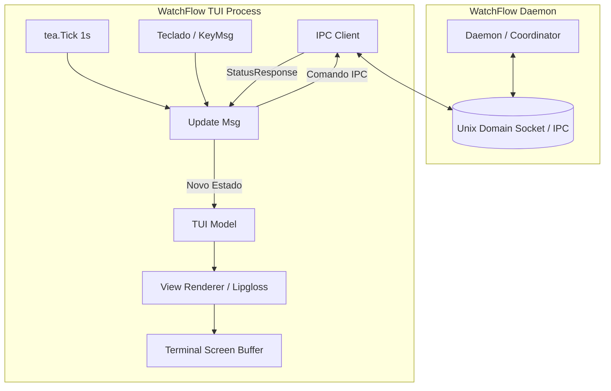

# Plano de Implementação — Fase 10: Interface Interativa de Terminal (TUI)

**Versão:** 1.0.0  
**Módulo:** `cmd/watchflow/tui.go` e `internal/tui/`  
**Status:** Aprovado para Execução  
**Documentos de Referência:**
* [Plano de Implementação - WatchFlow.md](file:///home/caio/GDrive/100%20-%20Projetos/WatchFlow/Plano%20de%20Implementa%C3%A7%C3%A3o%20-%20WatchFlow.md)
* [AGENTS.md](file:///home/caio/GDrive/100%20-%20Projetos/WatchFlow/AGENTS.md)

---

## 1. Visão Geral e Propósito

A **Fase 10** expande o ecossistema do WatchFlow com um painel interativo de terminal sob o comando `watchflow tui`. 

### Objetivos Centrais:
1. **Feedback Visual Imediato:** Permitir ao usuário acompanhar em tempo real o estado de seus cofres (Watchers), a fila de persistência SQLite WAL e o histórico de auditoria.
2. **Ergonomia Operacional:** Acionar comandos frequentes (`sync`, `pause`, `resume`, `refresh`) através de atalhos de teclado de uma tecla única (`s`, `p`, `r`), sem necessidade de memorizar flags CLI.
3. **Desacoplamento e Segurança:** A TUI atua estritamente como **cliente IPC sobre o Unix Domain Socket**. Se a TUI for fechada ou sofrer interrupção, o daemon em segundo plano (`systemd --user`) continua operando e sincronizando sem interrupção.
4. **Pure-Go e Zero CGO:** Garantir compatibilidade com `CGO_ENABLED=0` e compilação estática multiplataforma (Linux, macOS, Windows).

---

## 2. Arquitetura da TUI (The Elm Architecture)

A TUI adota o padrão funcional e reativo do ecossistema [Charmbracelet Bubble Tea](https://github.com/charmbracelet/bubbletea):



### Ciclo de Processamento:
* **`Model`:** Contém os dados em memória (status dos watchers, fila de jobs, largura/altura do terminal, painel em foco, mensagens temporárias de feedback).
* **`Update`:** Reage a eventos do terminal (`tea.KeyMsg`, `tea.WindowSizeMsg`) e mensagens assíncronas do IPC (`statusMsg`, `actionFeedbackMsg`), retornando o novo modelo e comandos (`tea.Cmd`).
* **`View`:** Função pura que compõe o layout em string usando estilos declarativos do `lipgloss`.

---

## 3. Mockup do Layout de Terminal

```text
┌── WatchFlow Monitor v1.0.0 ────────────────────────────────────────── [PID: 49201 | Uptime: 3h 42m] ──┐
│                                                                                                        │
│ COFRES VIGIADOS (WATCHERS)                                                                            │
│  ● [HEALTHY]  personal-vault   ~/Chaos                           (Último Sync: há 1m)                 │
│  ○ [PAUSED]   work-knowledge   ~/Projects/WorkVault              (Último Sync: 14:15)                 │
│                                                                                                        │
├──────────────────────────────────────────────────┬─────────────────────────────────────────────────────┤
│ FILA PERSISTENTE SQLITE (WAL)                    │ AUDITORIA E EVENTOS RECENTES                        │
│ ID            Pipeline     Status     Retries    │ [15:10:02] Watcher: personal-vault (2 arquivos)     │
│ job_184910    vault-sync   COMPLETED  0/5        │ [15:10:05] git.add: 2 arquivo(s) staged             │
│ job_184918    vault-sync   RUNNING    0/5        │ [15:10:06] git.commit: [49c81a] auto-sync           │
│                                                  │ [15:10:08] git.safe_sync: fast-forward limpo        │
│                                                  │ [15:10:09] git.push: remote origin atualizado       │
├──────────────────────────────────────────────────┴─────────────────────────────────────────────────────┤
│  [s] Sincronizar  │  [p] Pausar/Retomar  │  [r] Atualizar  │  [Tab] Mudar Foco  │  [q] Sair da TUI     │
└────────────────────────────────────────────────────────────────────────────────────────────────────────┘
```

---

## 4. Catálogo de Tickets da Fase 10

### [WF-017] Estrutura do Pacote TUI, Modelos e Estilização Lipgloss
* **Objetivo:** Adicionar dependências do ecossistema Charm e estruturar a apresentação visual.
* **Dependências Externas:**
  * `github.com/charmbracelet/bubbletea`
  * `github.com/charmbracelet/lipgloss`
  * `github.com/charmbracelet/bubbles`
* **Arquivos a Criar:**
  * `internal/tui/styles.go`: Paleta de cores, ícones, caixas com bordas arredondadas e badges de status.
  * `internal/tui/model.go`: Definição de `Model`, `TabFocus` e structs de estado da interface.
* **Critério de Aceite:** `go build` compila sem warnings com `CGO_ENABLED=0`.

---

### [WF-018] Ciclo Reativo, Integração com Socket IPC e Keybindings
* **Objetivo:** Conectar a TUI ao servidor IPC do daemon e implementar as ações acionadas pelo teclado.
* **Arquivos a Criar/Alterar:**
  * `internal/tui/update.go`:
    * Loop de tick periódico (polling de status a cada 1s).
    * Tratamento de atalhos de teclado:
      * `s`: Dispara `client.Sync(ctx, selectedWatcher)`.
      * `p`: Alterna `client.Pause` e `client.Resume`.
      * `r`: Recarregamento forçado imediato.
      * `Tab` / `Shift+Tab`: Alterna seleção entre a lista de watchers e a fila SQLite.
      * `↑` / `↓` (`k` / `j`): Navegação nos itens.
      * `q` / `Esc` / `Ctrl+C`: Sai da TUI de forma limpa sem afetar o daemon.
  * `internal/tui/view.go`: Renderização responsiva respeitando `tea.WindowSizeMsg`.
  * `cmd/watchflow/tui.go`: Subcomando Cobra `watchflow tui`.
* **Critério de Aceite:** Executar `./bin/watchflow tui` exibe os dados reais do daemon e atualiza na tela a cada evento.

---

### [WF-019] Testes de Unidade da TUI e Validação de Estabilidade
* **Objetivo:** Garantir que o loop da TUI seja testável de forma determinística e não quebre em terminais sem TTY (headless/CI).
* **Arquivos a Criar:**
  * `internal/tui/tui_test.go`: Testes usando o simulador de mensagens do Bubble Tea (`tea.Program` sem I/O físico).
* **Critério de Aceite:** `make test` e `make lint` aprovados com 100% de sucesso.

---

## 5. Matriz de Segurança e Anti-Data-Loss

| Requisito | Garantia Técnica |
|---|---|
| **Isolamento de Processo** | A TUI é um cliente efêmero. Se o terminal for fechado abruptamente, nenhum lock fica retido no daemon. |
| **Somente IPC** | A TUI **nunca** executa comandos `git` diretamente ou escreve na árvore do usuário; todas as intenções passam pelo pipeline seguro do daemon. |
| **Tratamento de Daemon Offline** | Se o daemon estiver desligado, a TUI exibe tela amigável informando que o serviço está parado e sugere `watchflow start` ou `systemctl --user start watchflow`. |
