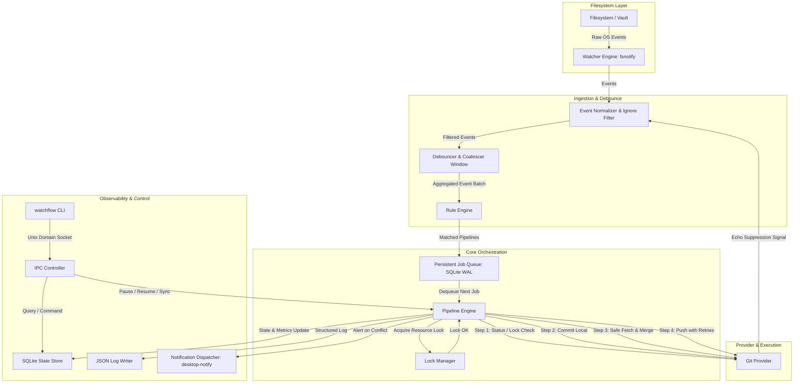
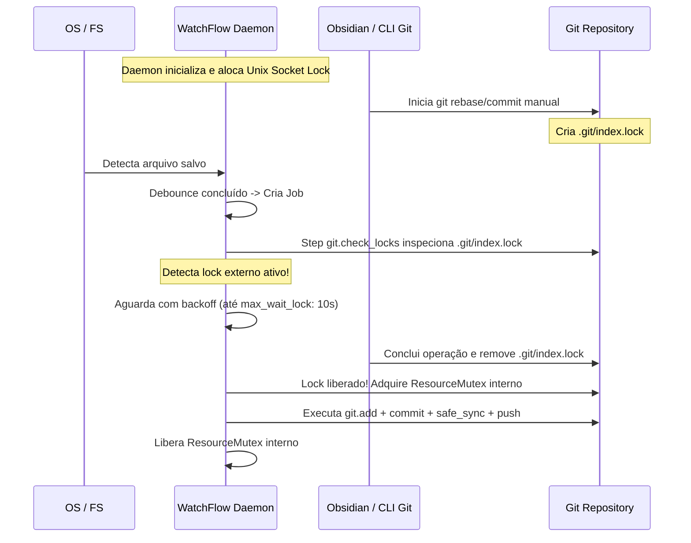
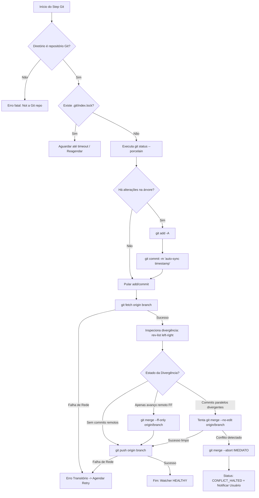
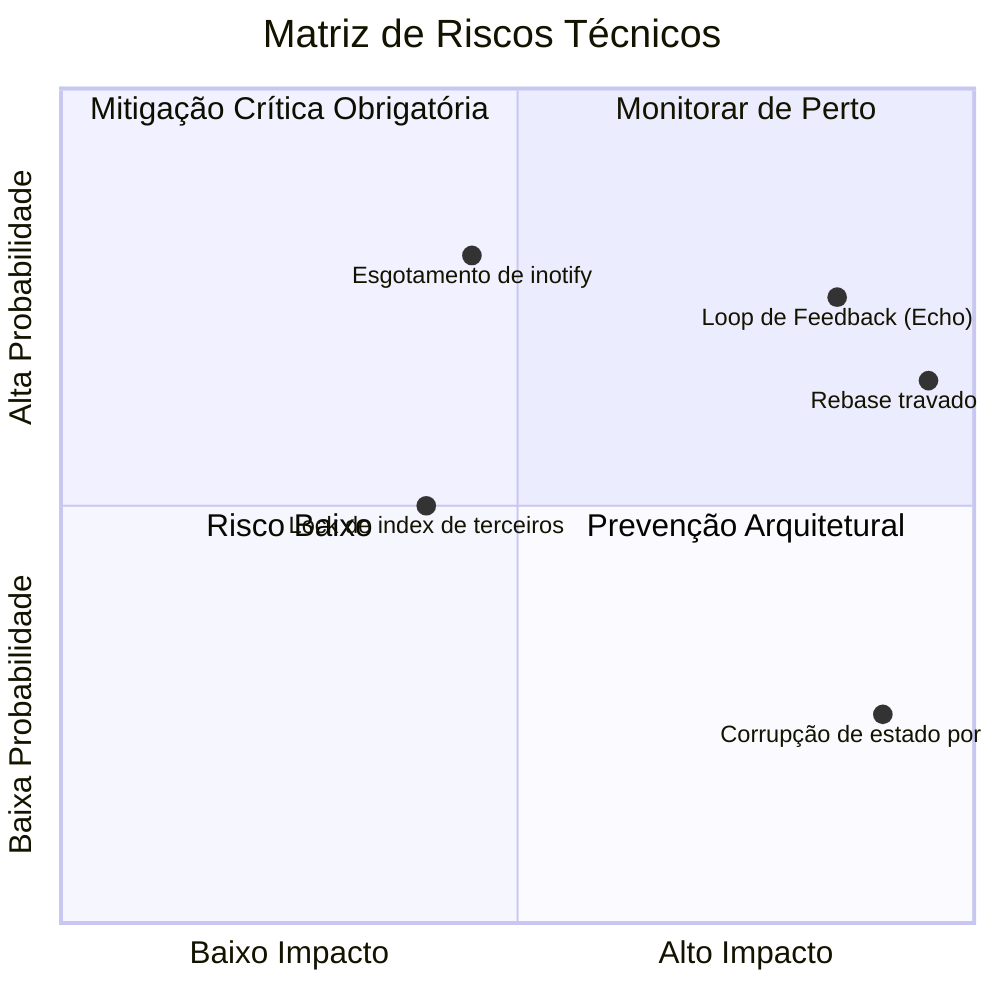
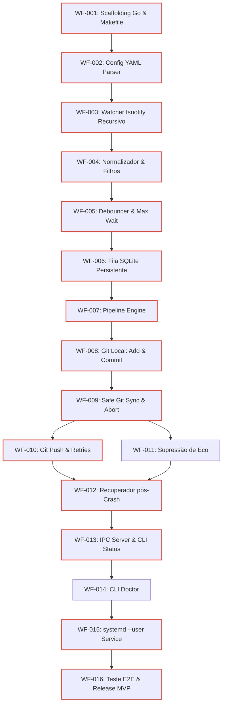

# Plano de Implementação da Arquitetura WatchFlow

**Status:** Aprovado para Planejamento / Aguardando Implementação  
**Versão:** 1.0.0  
**Data:** 2026-09-04  
**Autor:** Antigravity (Advanced Agentic Coding)  
**Referência Base:** [watchflow_prompt.md](file:///home/caio/Chaos/999_Sistema/Planos%20de%20Melhoria/watchflow_prompt.md)

---

## 1. Resumo Arquitetural

O **WatchFlow** é um daemon local reativo orientado a eventos de sistema de arquivos (*filesystem-driven automation daemon*), projetado para ser estritamente agnóstico quanto à aplicação de origem (Obsidian, editores de texto, IDEs, agentes de IA ou scripts em lote) e aos backends de destino (Git, nuvem, WebDAV, rsync).

Sua finalidade primária imediata é fornecer **sincronização bidirecional autônoma, resiliente e segura de vaults de conhecimento (como o Obsidian) entre múltiplas máquinas**, sem depender de plugins instalados no aplicativo nem exigir intervenções manuais de commit e push pelo usuário.

O fluxo de processamento opera no pipeline linear:
$$\text{File Event} \longrightarrow \text{Normalization} \longrightarrow \text{Debounce/Coalescing} \longrightarrow \text{Rule Engine} \longrightarrow \text{Job Queue} \longrightarrow \text{Pipeline Engine} \longrightarrow \text{Actions/Providers}$$

### Pilares Fundamentais:
1. **Preservação Absoluta de Dados (*Anti-Data-Loss*):** Nenhuma automação tem autorização para descartar, sobrescrever ou forçar alterações conflitantes. Em caso de divergência insolúvel automaticamente, o sistema interrompe o pipeline mantendo o diretório de trabalho limpo e notifica o usuário.
2. **Operação Offline-First:** Falhas temporárias de conectividade, DNS ou resposta de servidores remotos não impedem o registro local das alterações e acionam tentativas com backoff exponencial.
3. **Isolamento e Controle de Concorrência:** Respeito mútuo a travas externas (como `.git/index.lock`), locks cooperativos por repositório e proteção contra execução simultânea de múltiplos daemons.
4. **Economia e Silêncio:** Baixíssimo consumo de CPU/RAM em segundo plano, sem polling agressivo no disco e com supressão de notificações em fluxos de rotina bem-sucedidos.

---

## 2. Dúvidas e Inconsistências Encontradas na Especificação

Durante a análise integral do prompt de requisitos, foram identificadas quatro inconsistências técnicas críticas que precisaram de correção na modelagem arquitetural:

| Item | Inconsistência na Especificação Original | Diagnóstico Técnico | Correção Arquitetural Adotada |
|---|---|---|---|
| **1** | Uso irrestrito de `git pull --rebase` como pipeline padrão (Seções 2.3 e 5). | O comando `rebase` não assistido em sincronização autônoma pode estagnar em estado *detached HEAD* (`.git/rebase-apply` ou `.git/rebase-merge`) se houver divergência entre máquinas. Isso travaria o repositório para o usuário e para o Obsidian. | Substituição pelo protocolo **Safe Git Sync**: `git fetch` $\rightarrow$ análise de divergência de commits $\rightarrow$ `merge --ff-only` (se avanço limpo) ou `merge --no-edit` (se divergência sem conflito em mesmos arquivos). Se houver conflito de hunk, emitir `git merge --abort` imediatamente para manter o worktree intacto e sinalizar estado `CONFLICT_HALTED`. |
| **2** | Ausência de previsão para o "Loop de Feedback de Eventos" (*Event Echo*). | Quando o daemon executa `git pull` ou `git checkout`, arquivos são atualizados em lote pelo próprio Git. O watcher de `inotify` capturaria isso e dispararia um novo ciclo inútil de commit e push em cascata infinita. | Criação do mecanismo **Path Suppression Token / Echo Filter** no componente normalizador, silenciando eventos disparados em arquivos atualizados pelas ações do próprio daemon durante a janela da operação. |
| **3** | Sugestão de fila volátil em memória para o MVP vs. Requisito de recuperação pós-restart (Seções 4, 18 e 19). | Uma fila puramente em memória perderia jobs pendentes gerados offline caso o daemon fosse reiniciado ou o notebook desligado, violando o princípio offline-first. | Adoção de persistência leve desde o início via **SQLite em modo WAL** (pure-Go, CGO-free). Isso unifica fila, locks e métricas com garantias ACID e zero dependências de compilação. |
| **4** | Escopo ambíguo de locks (processo vs. repositório). | A especificação mesclava a necessidade de garantir instância única do daemon com a exclusão mútua de pipelines Git. | Segregação estrita em duas camadas de travamento: **Daemon Process Lock** (via socket Unix exclusivo em `/run/user/<uid>/watchflow.sock`) e **Resource Mutex/File Lock** (por caminho de repositório vigiado). |

---

## 3. Decisões Arquiteturais Necessárias

As seguintes decisões de engenharia formam o alicerce do projeto:

1. **Linguagem:** Go (versão 1.22+).
2. **Biblioteca de Filesystem Watching:** `github.com/fsnotify/fsnotify` com gerenciador recursivo interno de árvores de diretórios.
3. **Armazenamento de Estado e Fila:** SQLite embutido via driver pure-Go (`modernc.org/sqlite`), dispensando CGO.
4. **Formato de Configuração:** YAML estrito com esquema declarativo validado em tempo de carregamento (`gopkg.in/yaml.v3`).
5. **Debounce e Agrupamento:** Algoritmo de janela deslizante (*trailing debounce*) com teto inegociável (*hard deadline/max_wait*).
6. **Política de Retry:** Exponential Backoff com jitter aleatório para falhas transitórias e travamento imediato com notificação para erros determinísticos/conflitos.
7. **Comunicação Daemon-CLI:** Unix Domain Socket com serialização JSON-RPC leve.
8. **Gerenciamento de Ciclo de Vida:** Unidade de serviço `systemd --user` com targets de sessão de usuário.

---

## 4. ADRs Preliminares (Architecture Decision Records)

### ADR-001: Seleção da Linguagem Go para o Daemon e CLI
* **Contexto:** O sistema rodará continuamente em segundo plano, gerenciando concorrência de I/O, eventos de sistema e invocação de processos externos (Git).
* **Opções:** Go, Rust, Python.
* **Decisão:** **Go**.
* **Justificativa:** Go oferece goroutines e channels nativos perfeitos para o pipeline assíncrono reativo; compila em um único binário estático e portável (sem dependências de interpretador ou runtime); consome entre 15 e 30 MB de RAM em repouso; possui suporte excelente a `systemd` e bibliotecas consolidadas como `cobra` e `fsnotify`. Rust traria um custo elevado de desenvolvimento para manipulação de I/O assíncrono sem ganho real de desempenho; Python traria complexidade com ambientes virtuais, GIL e riscos de quebra de versão do sistema.
* **Consequências:** Binário autossuficiente de fácil distribuição; tempo de desenvolvimento reduzido; garantia de tipagem estática e baixa pegada de memória.

### ADR-002: Persistência Unificada com SQLite Pure-Go (CGO-Free)
* **Contexto:** O daemon precisa enfileirar jobs, armazenar métricas do `status`, salvar logs recentes e manter estado resistente a reinicializações abruptas e modo offline.
* **Opções:** Fila em memória com arquivo JSON; BoltDB (`bbolt`); SQLite (`mattn/go-sqlite3` com CGO); SQLite pure-Go (`modernc.org/sqlite`).
* **Decisão:** **SQLite via `modernc.org/sqlite` com modo WAL (Write-Ahead Logging)**.
* **Justificativa:** O SQLite provê transações ACID completas e capacidade de consulta estruturada (indispensável para o comando `watchflow status` e `watchflow logs`). A implementação pure-Go evita dependência de GCC/musl para compilação cruzada ou execução no Linux.
* **Consequências:** Zero dependências de compilação externa; integridade garantida contra corrupção em desligamentos repentinos.

### ADR-003: Estratégia de Sincronização Git ("Safe Git Sync")
* **Contexto:** Automações Git concorrentes em múltiplas máquinas correm risco de conflitos e corrupção do histórico local.
* **Opções:** `git pull --rebase`; `git pull` padrão; Protocolo isolado `fetch` + análise de divergência + `merge --ff-only` ou `merge --no-edit` + abort automático.
* **Decisão:** **Protocolo Safe Git Sync**.
* **Justificativa:** Rebase automático não assistido pode parar no meio e deixar o repositório em estado *detached*. A abordagem *Safe Sync* efetua o commit local, faz `git fetch`, inspeciona o grafo de commits com `git rev-list`. Se for fast-forward, aplica; se houver commits paralelos sem colisão de linhas, efetua merge commit sem intervenção interativa; se houver qualquer colisão de conteúdo, executa `git merge --abort` imediatamente, garantindo que o worktree volte a um estado seguro e limpo, marcando o job como pendente de intervenção humana.
* **Consequências:** O repositório nunca fica travado em estado intermediário. Dados locais permanecem commitados com segurança na branch local.

### ADR-004: Inibição de Eco de Eventos do Filesystem (*Echo Suppression*)
* **Contexto:** Operações do daemon que alteram a árvore de trabalho (ex.: `git pull`, `git checkout`) disparam eventos inotify que gerariam chamadas subsequentes indesejadas ao pipeline.
* **Opções:** Desregistrar temporariamente os watches do inotify; Criar lista negra temporal de arquivos alterados pela ação; Mutex de supressão global de eventos no Watcher durante a execução de steps de escrita.
* **Decisão:** **Supressão por Mutex de Pipeline + Registro de Timestamp de Ação**.
* **Justificativa:** Pausar watches no `inotify` no Linux pode perder eventos legítimos gerados pelo usuário simultaneamente em outras subpastas. O filtro de supressão registra os arquivos manipulados pelas ações do pipeline e sua janela temporal, descartando eventos equivalentes na camada de normalização se o timestamp for coincidente com a operação interna.
* **Consequências:** Eliminação completa de loops infinitos sem comprometer a integridade de eventos concorrentes legítimos.

---

## 5. Arquitetura Proposta



### Componentes Mínimos do Sistema:
1. **Watcher Engine:** Monitor recursivo baseado em `fsnotify`. Detecta adições de novas subpastas e adiciona automaticamente novos descritores de watch.
2. **Normalizer & Filter:** Normaliza caminhos canônicos (resolvendo symlinks) e aplica regras de descarte imediato (ignora `.git/**`, `.obsidian/cache/**`, `*.tmp`, backups temporários).
3. **Debouncer & Coalescer:** Agrupa eventos de um mesmo diretório raiz monitorado. Utiliza temporizador com janela deslizante (ex.: 15s) controlado por um teto absoluto (*max_wait*, ex.: 60s).
4. **Rule Engine:** Avalia se o lote de arquivos alterados satisfaz as condições configuradas para disparo dos pipelines declarados.
5. **Job Queue (SQLite):** Fila FIFO persistente transacional com garantia de que desligamentos repentinos do sistema não apaguem jobs pendentes.
6. **Pipeline Engine:** Executor de etapas sequenciais isoladas via `context.Context` com controle de timeouts e cancelamento limpo.
7. **Lock Manager:** Gerenciador de locks de processo (single instance) e locks de repositório (evita concorrência e aguarda liberação de `.git/index.lock` alheio).
8. **Git Provider:** Implementa as ações concretas: `git.status`, `git.add`, `git.commit`, `git.safe_sync`, `git.push`.
9. **IPC & CLI:** Servidor Unix Domain Socket expondo endpoints JSON para controle e auditoria em tempo real (`status`, `sync`, `pause`, `resume`, `doctor`).

---

## 6. Modelo de Dados e Estado

O arquivo de estado persistente reside em `~/.local/state/watchflow/state.db`.

### Esquema Relacional SQLite:

```sql
-- Watchers registrados
CREATE TABLE watchers (
    id TEXT PRIMARY KEY,
    name TEXT UNIQUE NOT NULL,
    path TEXT NOT NULL,
    status TEXT NOT NULL CHECK(status IN ('HEALTHY', 'DEGRADED', 'PAUSED', 'CONFLICT_HALTED')),
    last_event_at DATETIME,
    last_success_sync_at DATETIME,
    last_failed_sync_at DATETIME,
    last_error_message TEXT,
    created_at DATETIME DEFAULT CURRENT_TIMESTAMP,
    updated_at DATETIME DEFAULT CURRENT_TIMESTAMP
);

-- Fila de Jobs Persistente
CREATE TABLE jobs (
    id TEXT PRIMARY KEY,
    watcher_id TEXT NOT NULL REFERENCES watchers(id) ON DELETE CASCADE,
    pipeline_name TEXT NOT NULL,
    status TEXT NOT NULL CHECK(status IN ('PENDING', 'RUNNING', 'COMPLETED', 'FAILED', 'BLOCKED')),
    payload_files JSON NOT NULL,
    retry_count INTEGER DEFAULT 0,
    max_retries INTEGER DEFAULT 5,
    scheduled_for DATETIME DEFAULT CURRENT_TIMESTAMP,
    locked_by TEXT,
    locked_at DATETIME,
    last_error TEXT,
    created_at DATETIME DEFAULT CURRENT_TIMESTAMP,
    updated_at DATETIME DEFAULT CURRENT_TIMESTAMP
);

-- Histórico de Execução de Pipelines
CREATE TABLE pipeline_runs (
    id TEXT PRIMARY KEY,
    job_id TEXT REFERENCES jobs(id),
    watcher_id TEXT NOT NULL,
    pipeline_name TEXT NOT NULL,
    status TEXT NOT NULL,
    duration_ms INTEGER,
    error_step TEXT,
    error_details TEXT,
    created_at DATETIME DEFAULT CURRENT_TIMESTAMP
);

-- Locks Ativos por Recurso
CREATE TABLE resource_locks (
    resource_path TEXT PRIMARY KEY,
    owner_pid INTEGER NOT NULL,
    acquired_at DATETIME DEFAULT CURRENT_TIMESTAMP,
    heartbeat_at DATETIME DEFAULT CURRENT_TIMESTAMP
);

-- Índices de Performance
CREATE INDEX idx_jobs_pending ON jobs(status, scheduled_for);
CREATE INDEX idx_runs_created ON pipeline_runs(created_at);
```

---

## 7. Estrutura de Diretórios do Projeto

```text
watchflow/
├── cmd/
│   └── watchflow/
│       ├── main.go               # Ponto de entrada
│       ├── root.go               # Configuração global da CLI (Cobra)
│       ├── start.go              # watchflow start (modo foreground ou daemon)
│       ├── stop.go               # watchflow stop (envio de sinal ao daemon via socket)
│       ├── status.go             # watchflow status (tabela de saúde e métricas)
│       ├── sync.go               # watchflow sync (forçar execução imediata)
│       ├── pause.go              # watchflow pause (congelar captura de eventos)
│       ├── resume.go             # watchflow resume (descongelar captura)
│       ├── logs.go               # watchflow logs (tail do log estruturado)
│       ├── doctor.go             # watchflow doctor (checagem de limites e dependências)
│       └── config_cmd.go         # watchflow config validate
├── internal/
│   ├── config/                   # Leitura, parsing e validação de regras YAML
│   │   ├── config.go
│   │   └── validator.go
│   ├── core/                     # Orquestrador central e loop de eventos
│   │   ├── engine.go
│   │   └── coordinator.go
│   ├── watcher/                  # Monitoramento inotify/fsnotify recursivo
│   │   ├── watcher.go
│   │   └── tree.go
│   ├── normalizer/               # Limpeza de ruído e supressão de eco
│   │   ├── filter.go
│   │   └── echo_suppressor.go
│   ├── debouncer/                # Janela de debounce e teto max_wait
│   │   └── debouncer.go
│   ├── rules/                    # Motor de matching de arquivos e pipelines
│   │   └── engine.go
│   ├── queue/                    # Fila SQLite com recuperação transacional
│   │   ├── queue.go
│   │   └── store_sqlite.go
│   ├── pipeline/                 # Executor de etapas com cancelamento
│   │   ├── runner.go
│   │   └── context.go
│   ├── providers/                # Abstrações de provedores
│   │   ├── provider.go           # Interface ActionProvider
│   │   └── git/                  # Implementação do provider Git
│   │       ├── git.go
│   │       ├── safe_sync.go
│   │       └── lock_checker.go
│   ├── locking/                  # Gerenciador de travas cooperativas
│   │   ├── process_lock.go
│   │   └── file_lock.go
│   ├── notify/                   # Notificações do sistema operacional
│   │   └── notify.go
│   ├── ipc/                      # Servidor e cliente Unix Socket
│   │   ├── server.go
│   │   └── client.go
│   └── logger/                   # Logs estruturados em JSON
│       └── logger.go
├── configs/
│   └── watchflow.example.yaml    # Configuração de referência anotada
├── deploy/
│   └── systemd/
│       └── watchflow.service     # Unit file para systemd --user
├── docs/
│   └── adr/                      # Documentação de decisões de arquitetura
├── tests/
│   ├── testutil/                 # Criação de repositórios Git temporários simulados
│   │   └── git_sandbox.go
│   └── integration/              # Suítes de integração ponta a ponta
├── go.mod
├── go.sum
├── Makefile
└── README.md
```

---

## 8. Estratégia de Configuração

Arquivo canônico: `~/.config/watchflow/config.yaml` (substituível via `--config`).

```yaml
version: 1

daemon:
  state_dir: "~/.local/state/watchflow"
  socket_path: "/run/user/${UID}/watchflow.sock"
  log_level: "info" # debug, info, warn, error
  max_concurrent_pipelines: 2

notifications:
  enabled: true
  on_success: false
  on_error: true
  on_conflict: true
  backend: "desktop" # desktop (notify-send), log, webhook

watchers:
  - name: "personal-vault"
    path: "~/Chaos"
    enabled: true
    debounce: "15s"
    max_wait: "60s"

    ignore:
      - ".git/**"
      - ".obsidian/cache/**"
      - ".obsidian/workspace*"
      - "**/*.tmp"
      - "**/.DS_Store"
      - ".tmp/**"

    pipelines:
      - "vault-git-sync"

pipelines:
  vault-git-sync:
    timeout: "120s"
    steps:
      - action: "git.check_locks"
        params:
          max_wait_lock: "10s"

      - action: "git.add"
        params:
          all: true

      - action: "git.commit"
        params:
          message: "watchflow: auto-sync {{timestamp}}"
          allow_empty: false

      - action: "git.safe_sync"
        params:
          remote: "origin"
          branch: "master"
          strategy: "ff_or_safe_merge" # ff_or_safe_merge, rebase (desencorajado)

      - action: "git.push"
        params:
          remote: "origin"
          branch: "master"
          max_retries: 5
          retry_backoff: "exponential"
```

---

## 9. Lifecycle Completo de um Evento

```text
1. [OS Kernel] Notificação inotify disparada por escrita ou renomeação no arquivo.
2. [Watcher Engine] Captura do evento bruto e conversão para CanonicalPath.
3. [Normalizer & Filter]
   ├── Testa se o caminho casa com lista de ignores -> Se sim: DESCARTA.
   └── Testa se o arquivo está no EchoSuppressionWindow -> Se sim: DESCARTA.
4. [Debouncer & Coalescer]
   ├── Evento acumulado no buffer do watcher.
   ├── Reinicia o timer de debounce (15s).
   └── Se o teto max_wait (60s) for alcançado -> Força despacho imediato do batch.
5. [Rule Engine]
   └── Mapeia o conjunto de arquivos acumulados para o pipeline correspondente.
6. [Job Queue]
   └── Persiste o Job em estado PENDING no SQLite em transação atômica.
7. [Pipeline Engine / Worker]
   ├── Desenfileira o Job e marca como RUNNING.
   ├── Obtém o Resource Lock do repositório (~/Chaos).
   ├── Executa Steps:
   │   ├── git.check_locks (aguarda se houver .git/index.lock de terceiros)
   │   ├── git.add (stage das alterações)
   │   ├── git.commit (se não houver diff, completa com sucesso sem commit)
   │   ├── git.safe_sync (fetch remote -> merge se limpo; abort se conflito)
   │   └── git.push (envio com backoff caso o remote esteja offline)
   ├── Libera o Resource Lock.
   └── Atualiza status do Job para COMPLETED e watcher para HEALTHY.
8. [Observability / Logs]
   └── Registra métricas de duração, arquivos sincronizados e emite evento para socket.
```

---

## 10. Modelo de Concorrência e Locking



* **Process Lock:** O daemon cria um Unix Domain Socket exclusivo. Se o socket já estiver escutando, a segunda instância encerra imediatamente com código de erro 1.
* **External Git Lock Awareness:** O daemon jamais remove `.git/index.lock` automaticamente. Se o arquivo existir, o daemon suspende o step e realiza até 5 checagens com intervalos de 1 a 2 segundos. Caso a trava persista além do limite configurado, o job falha com status `WAITING_EXTERNAL_LOCK` para nova tentativa no próximo ciclo.
* **Internal Resource Mutex:** Um `sync.Mutex` mapeado por caminho canônico do repositório garante que duas goroutines de pipelines diferentes nunca operem simultaneamente na mesma árvore Git.

---

## 11. Estratégia de Tratamento de Erros

Os erros do sistema são categorizados rigorosamente em três tipos:

| Categoria | Definição / Exemplos | Comportamento do Daemon | Ação do Usuário Requerida |
|---|---|---|---|
| **Transitório** | Conexão de rede indisponível, falha momentânea de DNS, remote indisponível (HTTP 5xx / SSH timeout), `.git/index.lock` momentâneo. | Job mantido na fila com status `PENDING_RETRY`. Aplicação de Exponential Backoff. Logs em nível `WARN`. Watcher permanece `HEALTHY`. | Nenhuma (o sistema resolve autonomamente no retorno da rede). |
| **Bloqueante / Conflito** | Divergência de commits entre duas máquinas afetando as mesmas linhas de um mesmo arquivo (conflito de merge). | Executa `git merge --abort` imediatamente para restaurar a árvore de trabalho limpa. Marca o job como `BLOCKED`. Transforma status do watcher em `CONFLICT_HALTED`. Dispara notificação desktop. | Sim: o usuário deve resolver o conflito manualmente no repositório antes que o daemon retome. |
| **Configuração / Ambiente** | Permissão negada no diretório, caminho do repositório inexistente, chave SSH/token ausente ou inválido. | Interrompe o watcher afetado, status `DEGRADED`. Emite log `ERROR`. | Sim: corrigir arquivo de configuração ou permissões de credenciais. |

---

## 12. Estratégia de Retry

Para erros classificados como **Transitórios**, aplica-se o algoritmo:

$$T_{\text{wait}} = \min(T_{\text{max}}, T_{\text{base}} \times 2^{\text{retry}} + \text{jitter})$$

* $T_{\text{base}} = 5\text{ segundos}$
* $T_{\text{max}} = 300\text{ segundos (5 minutos)}$
* $\text{jitter} = \text{valor aleatório entre } 0 \text{ e } 3\text{ segundos}$
* $\text{max\_retries} = 8\text{ tentativas}$

Se as 8 tentativas forem esgotadas sem sucesso, o job não é destruído: é marcado como `FAILED_EXHAUSTED` e o watcher passa para `DEGRADED`. Um comando `watchflow sync` ou o restabelecimento explícito do serviço força o reprocessamento imediato.

---

## 13. Estratégia Específica do Provider Git (Safe Git Sync)



### Regras Estritas do Git Provider:
1. **Commit Local Antes de Tudo:** Nenhuma operação de fetch ou merge altera arquivos sem que o trabalho local gerado no cofre já esteja em segurança dentro de um commit local.
2. **Prevenção de Commits Vazios:** Se `git status --porcelain` retornar vazio, os steps `git.add` e `git.commit` são ignorados sem erro.
3. **Inviolabilidade da Árvore de Trabalho:** Se a tentativa de junção de históricos remotos disparar conflito de conteúdo, a execução de `git merge --abort` é **imediata e mandatória**. Nenhum marcador de conflito (`<<<<<<< HEAD`) é gravado em arquivos Markdown pelo daemon.

---

## 14. Modelo de Extensibilidade para Futuros Providers e Actions

Cada provider implementa a interface Go:

```go
package providers

import (
    "context"
    "time"
)

type StepContext struct {
    Context       context.Context
    WatcherName   string
    BasePath      string
    ChangedFiles  []string
    StepParams    map[string]interface{}
    LastOutput    string
    Timestamp     time.Time
}

type StepResult struct {
    Success      bool
    Skipped      bool
    TransientErr bool
    ErrorMessage string
    AffectedPaths []string
}

type ActionProvider interface {
    Name() string
    Validate(params map[string]interface{}) error
    Execute(ctx *StepContext) (*StepResult, error)
}
```

O registro de novos providers (WebDAV, S3, Script, Embedding) é realizado no inicializador do core através de um factory registry:
`providers.Register("git.safe_sync", git.NewSafeSyncAction())`

---

## 15. Estratégia de Observabilidade

1. **Logs Estruturados:** Formato JSON Line emitido para `~/.local/state/watchflow/logs/watchflow.log` com rotação integrada (10 MB por arquivo, retenção de 5 backups).
   ```json
   {"level":"info","ts":"2026-09-04T18:40:00.123-03:00","watcher":"personal-vault","pipeline":"vault-git-sync","step":"git.safe_sync","duration_ms":312,"status":"success"}
   ```
2. **Comando `watchflow status`:** Exibe painel em terminal tabular contendo:
   * Estado de saúde de cada watcher (`HEALTHY`, `PAUSED`, `CONFLICT`);
   * Timestamps do último evento, último sync com sucesso e última falha;
   * Contagem de jobs pendentes na fila;
   * Informações do Git remote, branch e commits à frente/atrás.
3. **Comando `watchflow doctor`:** Inspeciona o ambiente antes ou durante a operação:
   * Verifica se o binário `git` está acessível e versão mínima $\ge 2.28$;
   * Checa se o limite do kernel `fs.inotify.max_user_watches` é compatível com o tamanho da árvore vigiada;
   * Testa conectividade com os remotes configurados;
   * Valida integridade do banco SQLite local.

---

## 16. Estratégia de Segurança

1. **Isolamento de Comandos:** O daemon invoca o executável `git` diretamente via `exec.CommandContext` com argumentos separados em array. É estritamente proibido o uso de `sh -c` ou shells intermediários, impedindo vetores de Command Injection em nomes de arquivos contendo espaços ou caracteres especiais.
2. **Proteção contra Path Traversal e Symlinks:** Todo caminho monitorado ou reportado em eventos é resolvido para seu caminho absoluto canônico via `filepath.EvalSymlinks`. Eventos originados fora do limite do diretório raiz configurado são rejeitados.
3. **Ofuscação de Credenciais:** As URLs de remotes e saídas do Git são sanitizadas por regex antes de serem gravadas nos arquivos de log ou banco de dados para suprimir eventuais tokens e chaves embutidas (`https://token@...`).
4. **Permissões de Arquivo:** O socket Unix e o banco de dados `state.db` são criados com permissões restritas ao usuário atual (`0600` e `0700`).

---

## 17. Estratégia de Testes

* **Pirâmide de Testes:**
  * **Testes Unitários:** 70% da cobertura. Validação de parsing de YAML, cálculo de janelas de debounce, normalização de paths e lógica de matching de regras.
  * **Testes de Integração:** 25% da cobertura. Uso do pacote `testutil.GitSandbox` para criar repositórios Git temporários reais no `/tmp`, com servidores upstream simulados via diretórios Git bare locais.
  * **Testes E2E e Smoke:** 5% da cobertura. Execução do binário compilado monitorando um diretório real, disparando alterações no filesystem e avaliando saídas via CLI `watchflow status`.

---

## 18. Roadmap por Fases

```text
Fase 0: Arquitetura, Scaffolding e Configuração
Fase 1: Watcher de Filesystem e Normalizador de Eventos
Fase 2: Motor de Debounce, Coalescência e Fila SQLite
Fase 3: Pipeline Engine e Abstração de Providers
Fase 4: Provider Git Local (Safe Commit e Trava de Index)
Fase 5: Git Remote Sync (Safe Sync, Merge Abort e Retries)
Fase 6: Resiliência Offline, Persistência e Recuperação de Falhas
Fase 7: Servidor IPC, CLI de Gerenciamento e Observabilidade
Fase 8: Integração com systemd, Segurança e Hardening
Fase 9: Homologação Final do MVP e Demonstração
```

---

## 19. Tickets de Implementação Detalhados por Fase

### Fase 0: Arquitetura, Scaffolding e Configuração

#### [WF-001] Scaffolding do repositório Go e módulo base
* **Objetivo:** Estabelecer o esqueleto do projeto com `go.mod`, linting, Makefile e estrutura canônica de pastas.
* **Contexto:** Projeto novo em Go que servirá tanto de daemon quanto de CLI.
* **Escopo:** Criação do módulo Go, Makefile para build e testes, configuração do `golangci-lint` e estrutura de pacotes `cmd/` e `internal/`.
* **Fora de escopo:** Implementação de lógica de negócios.
* **Dependências:** Nenhuma.
* **Arquivos esperados:** `go.mod`, `Makefile`, `.golangci.yml`, `cmd/watchflow/main.go`.
* **Implementação esperada:** Configurar `go 1.22+`, flags estritas de compilação e comandos no Makefile (`make build`, `make test`, `make lint`).
* **Critérios de aceitação:** `make build` compila binário vazio funcional; `make test` passa com 0 erros.
* **Testes:** Teste de compilação e execução de smoke (`watchflow --help`).
* **Riscos:** Incompatibilidade de versão de Go no ambiente do usuário.
* **Definition of Done:** Binário compilável, Makefile funcional e pipeline de lint configurado.

#### [WF-002] Mecanismo de parsing e validação da configuração YAML
* **Objetivo:** Carregar e validar rigorosamente o arquivo `config.yaml`.
* **Contexto:** O comportamento dos watchers e pipelines depende de declarações em YAML.
* **Escopo:** Parser com `gopkg.in/yaml.v3`, validação semântica de caminhos e durações (ex.: "15s").
* **Fora de escopo:** Criação dinâmica de arquivos de configuração.
* **Dependências:** [WF-001].
* **Arquivos esperados:** `internal/config/config.go`, `internal/config/validator.go`, `configs/watchflow.example.yaml`.
* **Implementação esperada:** Structs tipadas para daemon, watchers e pipelines; validação de caminhos existentes e detecção de campos ausentes obrigatórios.
* **Critérios de aceitação:** Retorna erro inteligível ao carregar YAML com caminhos inexistentes ou sintaxe inválida.
* **Testes:** Testes unitários com fixtures de YAML válidos e inválidos.
* **Riscos:** Falha ao expandir `~` ou variáveis de ambiente no path.
* **Definition of Done:** 100% de cobertura nos testes unitários do pacote de config.

---

### Fase 1: Watcher de Filesystem e Normalizador de Eventos

#### [WF-003] Implementação do Watcher recursivo com fsnotify
* **Objetivo:** Monitorar recursivamente todos os subdiretórios de uma pasta configurada.
* **Contexto:** `fsnotify` no Linux não monitora novas subpastas criadas após o início do processo por padrão.
* **Escopo:** Adicionar watches dinamicamente ao detectar evento `Create` sobre novos diretórios; remover watches ao deletar.
* **Fora de escopo:** Debounce ou filtros de extensão.
* **Dependências:** [WF-002].
* **Arquivos esperados:** `internal/watcher/watcher.go`, `internal/watcher/tree.go`.
* **Implementação esperada:** Função recursiva para registrar pastas existentes e listener em goroutine para novos diretórios.
* **Critérios de aceitação:** Criar subdiretório `a/b/c` em tempo de execução ativa o watch imediatamente sem reiniciar o daemon.
* **Testes:** Teste unitário criando árvores de pastas temporárias e validando captura de eventos.
* **Riscos:** Esgotamento de descritores de inotify em diretórios gigantescos.
* **Definition of Done:** Captura de eventos em qualquer profundidade da árvore.

#### [WF-004] Normalizador de eventos e filtro de ignorados
* **Objetivo:** Filtrar ruído de arquivos temporários e padronizar eventos brutos do sistema.
* **Contexto:** Editores e Git geram centenas de arquivos efêmeros (`.tmp`, `.git/index.lock`).
* **Escopo:** Casamento de padrões glob (`.git/**`, `*.tmp`) e resolução de paths canônicos absolutos.
* **Fora de escopo:** Debounce temporal.
* **Dependências:** [WF-003].
* **Arquivos esperados:** `internal/normalizer/filter.go`.
* **Implementação esperada:** Uso de `path/filepath` e engine de glob com cache de compilação de regras.
* **Critérios de aceitação:** Eventos em `.git/index` ou `.obsidian/cache` são descartados em < 1ms sem avançar no pipeline.
* **Testes:** Tabela de testes com 30 casos de caminhos ignorados e permitidos.
* **Riscos:** Regex de glob ineficiente causando gargalo em lote maciço de arquivos.
* **Definition of Done:** Todos os arquivos de ruído padrão descartados com segurança.

---

### Fase 2: Motor de Debounce, Coalescência e Fila SQLite

#### [WF-005] Mecanismo de Debounce com Trailing Window e Max Wait
* **Objetivo:** Coalescer centenas de alterações rápidas em um único lote de eventos.
* **Contexto:** Ao salvar notas ou compilar, múltiplos eventos de escrita ocorrem em frações de segundo.
* **Escopo:** Implementação de temporizador rearmável com teto de espera rígido (*hard deadline*).
* **Fora de escopo:** Persistência dos eventos no disco.
* **Dependências:** [WF-004].
* **Arquivos esperados:** `internal/debouncer/debouncer.go`.
* **Implementação esperada:** Canal de ingestão com timer de janela deslizante (ex.: 15s) e timestamp limite (`max_wait`, 60s) que força o disparo se o fluxo for contínuo.
* **Critérios de aceitação:** 50 escritas em 5 segundos geram exatamente 1 disparo agrupado após o silêncio da janela.
* **Testes:** Testes com simulação de tempo acelerado via canais de mock.
* **Riscos:** Travamento de goroutines se canais ficarem cheios.
* **Definition of Done:** Garantia de agrupamento sem inanição de eventos contínuos.

#### [WF-006] Persistência da Fila de Jobs em SQLite
* **Objetivo:** Salvar lotes coalescidos em banco local ACID para resiliência a crashes.
* **Contexto:** Se o processo cair antes da execução do pipeline, a intenção de sync não pode ser perdida.
* **Escopo:** Tabelas `watchers` e `jobs`, métodos de enqueue, dequeue atômico e transições de estado.
* **Fora de escopo:** Execução do job.
* **Dependências:** [WF-005].
* **Arquivos esperados:** `internal/queue/queue.go`, `internal/queue/store_sqlite.go`.
* **Implementação esperada:** Driver `modernc.org/sqlite` com modo `PRAGMA journal_mode=WAL;`.
* **Critérios de aceitação:** Jobs enfileirados sobrevivem ao encerramento imediato do processo com `SIGKILL`.
* **Testes:** Teste de inserção de 1000 jobs e reabertura do banco para validação de integridade.
* **Riscos:** Concorrência de escrita no SQLite gerando erro `database is locked`.
* **Definition of Done:** Fila transacional com suporte a retry e recuperação de estado.

---

### Fase 3: Pipeline Engine e Abstração de Providers

#### [WF-007] Engine de execução de Pipelines sequenciais
* **Objetivo:** Executar sequências declaradas de ações com controle de timeout e contexto.
* **Contexto:** Pipelines são compostos por steps que devem ser interrompidos em caso de falha.
* **Escopo:** Orquestrador sequencial de steps com suporte a `context.WithTimeout`.
* **Fora de escopo:** Implementação específica do Git.
* **Dependências:** [WF-006].
* **Arquivos esperados:** `internal/pipeline/runner.go`, `internal/pipeline/context.go`, `internal/providers/provider.go`.
* **Implementação esperada:** Interface `ActionProvider` e loop de execução que aborta os passos seguintes se o passo atual falhar.
* **Critérios de aceitação:** Se o Step 2 falha, os Steps 3 e 4 não são executados e o status do erro é gravado no banco.
* **Testes:** Teste de pipeline com mock providers simulando sucesso, erro e timeout.
* **Riscos:** Vazamento de goroutines se o contexto não for cancelado adequadamente.
* **Definition of Done:** Engine de pipelines agnóstica com controle de falha em cascata.

---

### Fase 4: Provider Git Local (Safe Commit e Trava de Index)

#### [WF-008] Ações Git locais: detecção de lock, add e commit seguro
* **Objetivo:** Realizar commits locais sem gerar commits vazios e respeitando travas de terceiros.
* **Contexto:** Garantir que o trabalho local seja commitado sem corrupção e sem conflitar com `.git/index.lock`.
* **Escopo:** Actions `git.check_locks`, `git.add` e `git.commit`.
* **Fora de escopo:** Sincronização com servidores remotos.
* **Dependências:** [WF-007].
* **Arquivos esperados:** `internal/providers/git/git.go`, `internal/providers/git/lock_checker.go`.
* **Implementação esperada:** Invocação direta do binário `git` via `os/exec`; detecção de alterações via `git status --porcelain`.
* **Critérios de aceitação:** Quando não há alterações reais, o step de commit é pulado com sucesso; se houver `.git/index.lock`, aguarda até o timeout configurado.
* **Testes:** Teste de integração em repositório temporário criando e commitando arquivos dinamicamente.
* **Riscos:** Mensagem de commit formatada incorretamente.
* **Definition of Done:** Ações locais executadas de forma idempotente e segura.

---

### Fase 5: Git Remote Sync (Safe Sync, Merge Abort e Retries)

#### [WF-009] Mecanismo Safe Git Sync (Fetch, FF/Safe Merge e Abort Automático)
* **Objetivo:** Integrar alterações remotas sem permitir estados de rebase corrompidos ou marcadores de conflito na árvore de trabalho.
* **Contexto:** A sincronização entre duas máquinas pode gerar divergência de histórico.
* **Escopo:** Action `git.safe_sync`. Execução de `git fetch`, checagem de divergência com `rev-list`, avanço fast-forward ou merge sem edição; abort imediato se houver colisão.
* **Fora de escopo:** Resolução interativa de conflitos.
* **Dependências:** [WF-008].
* **Arquivos esperados:** `internal/providers/git/safe_sync.go`.
* **Implementação esperada:** Se `git merge` retornar código de saída indicando conflito, executar `git merge --abort` e retornar `ErrMergeConflict`.
* **Critérios de aceitação:** Repositório nunca fica com arquivos contendo `<<<<<<<` e volta ao estado limpo imediatamente após conflito detectado.
* **Testes:** Teste simulando duas máquinas em branches divergentes editando o mesmo arquivo e validando o acionamento do abort.
* **Riscos:** Inconsistência caso o abort falhe por permissão.
* **Definition of Done:** Protocolo Safe Sync validado com proteção absoluta contra corrupção do repositório.

#### [WF-010] Ação `git.push` com tolerância a falhas e política de retry
* **Objetivo:** Enviar commits locais ao remote com backoff exponencial se a rede estiver fora do ar.
* **Contexto:** Operação em notebooks que frequentemente perdem sinal Wi-Fi.
* **Escopo:** Action `git.push` com retry exponencial e jitter.
* **Fora de escopo:** Alteração de configurações de credenciais SSH.
* **Dependências:** [WF-009].
* **Arquivos esperados:** `internal/providers/git/push.go`.
* **Implementação esperada:** Classificação de saídas de erro de rede para aplicar `TransientErr: true`.
* **Critérios de aceitação:** Em caso de desconexão, o job permanece em `PENDING_RETRY` sem quebrar o daemon.
* **Testes:** Teste com remote Git simulando falha de conexão e retorno posterior.
* **Riscos:** Push rejeitado por *non-fast-forward* (deve engatilhar novo ciclo de safe_sync).
* **Definition of Done:** Push resiliente que tolera períodos offline.

#### [WF-011] Supressão de Eco de Eventos no Watcher
* **Objetivo:** Silenciar eventos de filesystem gerados pelo próprio `git pull`.
* **Contexto:** Evitar que a atualização de arquivos remotos crie um loop contínuo de commits.
* **Escopo:** Registro temporário de arquivos manipulados pelo Git e filtragem no normalizer.
* **Dependências:** [WF-009].
* **Arquivos esperados:** `internal/normalizer/echo_suppressor.go`.
* **Implementação esperada:** Mapa thread-safe de hashes de caminhos e timestamps com expiração de 2 segundos.
* **Critérios de aceitação:** Execução de `git pull` com 20 notas alteradas gera 0 novos jobs de commit.
* **Testes:** Teste disparando pull remoto e verificando que a fila de jobs permaneceu vazia.
* **Riscos:** Ignorar alteração legítima do usuário feita no mesmo milissegundo em outro arquivo.
* **Definition of Done:** Supressão cirúrgica de eventos gerados internamente.

---

### Fase 6: Resiliência Offline, Persistência e Recuperação de Falhas

#### [WF-012] Recuperador de Estado no Startup do Daemon
* **Objetivo:** Recuperar e reprocessar jobs órfãos deixados por desligamentos inesperados.
* **Contexto:** Se a máquina for desligada durante um sync, o daemon precisa restabelecer a consistência.
* **Escopo:** Limpeza de jobs em estado `RUNNING` para `PENDING` e auditoria de locks de arquivo órfãos no boot.
* **Fora de escopo:** Rollback de commits Git locais já concluídos.
* **Dependências:** [WF-010].
* **Arquivos esperados:** `internal/core/recovery.go`.
* **Implementação esperada:** Consulta no SQLite ao inicializar para resetar flags de trava e reagendar jobs pendentes.
* **Critérios de aceitação:** Matar o processo com `kill -9` durante a execução e religar restaura o job para conclusão com sucesso.
* **Testes:** Teste de integração matando o processo e validando recuperação automática no reinício.
* **Riscos:** Loop de crash se um job for permanentemente fatal (deve ser limitado por `max_retries`).
* **Definition of Done:** Inicialização resiliente a falhas graves anteriores.

---

### Fase 7: Servidor IPC, CLI de Gerenciamento e Observabilidade

#### [WF-013] Servidor IPC via Unix Domain Socket e Comandos Básicos da CLI
* **Objetivo:** Permitir interação entre a CLI do usuário e o daemon em execução.
* **Contexto:** O usuário precisa consultar o estado e gerenciar o daemon sem olhar arquivos de log brutos.
* **Escopo:** Servidor Unix Socket, protocolo JSON-RPC, comandos `watchflow status`, `watchflow sync`, `watchflow pause`, `watchflow resume`.
* **Fora de escopo:** Interface gráfica.
* **Dependências:** [WF-012].
* **Arquivos esperados:** `internal/ipc/server.go`, `internal/ipc/client.go`, `cmd/watchflow/status.go`, `cmd/watchflow/pause.go`.
* **Implementação esperada:** Socket em `/run/user/<uid>/watchflow.sock` (fallback para `~/.local/state/watchflow/`).
* **Critérios de aceitação:** `watchflow status` exibe tabela formatada com saúde dos repositórios e status dos jobs em tempo real.
* **Testes:** Teste unitário de cliente/servidor IPC e testes manuais da CLI.
* **Riscos:** Permissões incorretas no socket bloqueando comandos de outros terminais do mesmo usuário.
* **Definition of Done:** CLI rápida e responsiva controlando o daemon.

#### [WF-014] Comando de Diagnóstico `watchflow doctor`
* **Objetivo:** Validar requisitos do sistema e identificar problemas de configuração antes da falha.
* **Contexto:** Usuários podem ter limites de inotify baixos ou versões desatualizadas do Git.
* **Escopo:** Checagem de `fs.inotify.max_user_watches`, versão do Git, permissões de escrita e validade da configuração.
* **Fora de escopo:** Correção automática de arquivos do kernel.
* **Dependências:** [WF-013].
* **Arquivos esperados:** `cmd/watchflow/doctor.go`.
* **Implementação esperada:** Leitura de `/proc/sys/fs/inotify/max_user_watches` e execução de testes de handshake com remotes.
* **Critérios de aceitação:** Emite diagnóstico claro e instruções de correção caso watches sejam insuficientes.
* **Testes:** Teste em ambiente simulado com limites baixos.
* **Riscos:** Erro ao tentar ler `/proc` em ambientes restritos/containers.
* **Definition of Done:** Diagnóstico detalhado de todo o ambiente operacional.

---

### Fase 8: Integração com systemd, Segurança e Hardening

#### [WF-015] Criação de Unit File do systemd --user e Gerenciamento de Ciclo de Vida
* **Objetivo:** Permitir que o daemon inicie automaticamente no login da sessão do usuário no Linux.
* **Contexto:** O daemon deve ser transparente e persistente durante o uso da máquina.
* **Escopo:** Criação do arquivo `watchflow.service` em `deploy/systemd/`, suporte a sinais `SIGTERM` e `SIGINT` com graceful shutdown.
* **Fora de escopo:** Inicialização em nível de root do sistema.
* **Dependências:** [WF-014].
* **Arquivos esperados:** `deploy/systemd/watchflow.service`, `cmd/watchflow/start.go`.
* **Implementação esperada:** `Type=simple`, `Restart=on-failure`, `RestartSec=5s`, gerenciamento limpo de cancelamento de goroutines no SIGTERM.
* **Critérios de aceitação:** `systemctl --user start watchflow` inicializa o serviço perfeitamente; encerramento limpo sem corromper o banco.
* **Testes:** Testes manuais de ciclo de vida com `systemctl --user`.
* **Riscos:** Variável `XDG_RUNTIME_DIR` ausente em sessões SSH puras.
* **Definition of Done:** Serviço perfeitamente integrado à sessão do usuário Linux.

---

### Fase 9: Homologação Final do MVP e Demonstração

#### [WF-016] Suíte de Testes de Homologação Ponta a Ponta do MVP
* **Objetivo:** Validar o cenário de demonstração do MVP com simulação de conectividade instável.
* **Contexto:** Garantir que o MVP cumpra todos os requisitos antes de ser colocado em produção no cofre principal.
* **Escopo:** Script automatizado de teste simulando edição no cofre, perda de rede, tentativa de push, retorno de rede e sync final.
* **Fora de escopo:** Testes em sistemas operacionais não-Linux.
* **Dependências:** [WF-015].
* **Arquivos esperados:** `tests/integration/mvp_demo_test.go`.
* **Implementação esperada:** Orquestração completa de repositório local e remoto simulados com validação de status via CLI.
* **Critérios de aceitação:** Todos os passos do roteiro de demonstração aprovados com 0 perdas de dados.
* **Testes:** Execução do teste de homologação automatizado via `go test -v ./tests/integration/...`.
* **Riscos:** Flakiness em testes de concorrência temporal (resolvido com timeouts generosos).
* **Definition of Done:** MVP homologado e documentado no cofre.

---

## 20. Testes Intermediários Obrigatórios por Fase

| Fase | Tipo de Teste | Descrição da Validação Obrigatória |
|---|---|---|
| **Fase 0** | Unitário | Validação de parsing de YAML com esquemas truncados e tipos errados. |
| **Fase 1** | Integração | Monitoramento de criação recursiva de 5 níveis de pastas geradas em menos de 100ms. |
| **Fase 2** | Stress / Unit | Ingestão de 500 eventos de arquivo em rajada garantindo exato 1 lote coalescido. |
| **Fase 3** | Mock | Interrupção do pipeline em step intermediário simulando cancelamento de contexto. |
| **Fase 4** | Integração | Commit em repositório local temporário com bloqueio forçado de `.git/index.lock`. |
| **Fase 5** | Integração / Conflito | Simulação de conflito de merge entre duas máquinas com validação de `git merge --abort`. |
| **Fase 6** | Falha / Crash | Envio de sinal `SIGKILL` no meio de um sync e checagem de recuperação no reboot. |
| **Fase 7** | Smoke / CLI | Execução sequencial dos comandos `status`, `pause`, `sync` e `resume` via socket. |
| **Fase 8** | Sistema | `systemctl --user start/restart/stop` com validação de saída limpa nos logs. |
| **Fase 9** | E2E | Execução integral do Roteiro de Demonstração do MVP (Seção 27). |

---

## 21. Critérios de Aprovação e Reprovação por Fase

* **Critério Universal de Reprovação:** Qualquer cenário que resulte em modificação indesejada, descarte de alterações do usuário ou estado intermediário sujo no Git interrompe imediatamente o avanço para a fase seguinte.
* **Aprovação de Fase:** Todos os testes unitários da fase atingindo 100% de sucesso, sem vazamento de goroutines e com documentação dos novos módulos integrada.

---

## 22. Riscos Técnicos e Mitigações



1. **Loop de Feedback do Watcher (*Echo Effect*):**
   * *Mitigação:* Supressor temporal de eventos baseado em janelas curtas de hash de arquivos alterados pelo próprio daemon.
2. **Repositório Git travado em estado intermediário:**
   * *Mitigação:* Execução compulsória de `git merge --abort` ao primeiro sinal de colisão de conteúdo.
3. **Esgotamento de descritores de inotify no kernel:**
   * *Mitigação:* Validação no `watchflow doctor` e descarte precoce de diretórios ignorados (`.git/**`) antes de registrar o watch.
4. **Perda de trabalho offline:**
   * *Mitigação:* Persistência atômica da intenção na fila SQLite antes de qualquer chamada de rede.

---

## 23. Definição Objetiva do MVP

O MVP do WatchFlow é considerado **concluído e entregue** quando:
1. Executar no ambiente Linux como daemon gerenciado por `systemd --user`.
2. Monitorar um vault real (ex.: `~/Chaos`) sem consumir mais que 1% de CPU em repouso ou mais que 40 MB de memória RAM.
3. Agrupar modificações contínuas por debounce de 15 segundos (teto de 60s) e realizar commits locais automáticos com mensagens padronizadas.
4. Realizar `git fetch` e envio seguro para o remote Git configurado sem intervenção do usuário.
5. Em caso de perda de internet, reter as alterações commitadas localmente e efetuar o envio automaticamente quando a conectividade for restabelecida.
6. Em caso de divergência insolúvel entre duas máquinas, abortar imediatamente a fusão, preservar a árvore limpa, marcar o status como `CONFLICT_HALTED` e notificar o usuário na área de trabalho.
7. Responder aos comandos `watchflow status`, `sync`, `pause`, `resume` e `doctor` via linha de comando em menos de 200 milissegundos.

---

## 24. Backlog Pós-MVP

* [ ] **Suporte a Provedores de Armazenamento em Nuvem:** Implementação de drivers para rsync sobre SSH, WebDAV e baldes S3 compatíveis.
* [ ] **Triggers de Eventos Avançados:** Acionamento de sync em eventos de sistema como `system.suspend`, `system.resume` e ganho de conectividade de rede (`network.online`).
* [ ] **Portabilidade para Outros Sistemas Operacionais:** Adaptação do daemon para macOS (`LaunchAgent` e `fsevents`) e Windows (`Windows Service` e `ReadDirectoryChangesW`).
* [ ] **Geração de Embeddings e Workflows de Agentes:** Ações de pipeline que disparam automações de IA (como indexação semântica ou geração de embeddings) ao detectar notas novas criadas.
* [ ] **Applet de Bandeja (System Tray):** Pequeno ícone de status na barra de tarefas (GNOME/KDE) para visualização rápida da saúde da sincronização.

---

## 25. Grafo de Dependências entre Tickets



---

## 26. Caminho Crítico (Critical Path)

Os tickets que determinam a duração mínima para disponibilização do MVP são:
$$\text{WF-001} \rightarrow \text{WF-002} \rightarrow \text{WF-003} \rightarrow \text{WF-004} \rightarrow \text{WF-005} \rightarrow \text{WF-006} \rightarrow \text{WF-007} \rightarrow \text{WF-008} \rightarrow \text{WF-009} \rightarrow \text{WF-010} \rightarrow \text{WF-012} \rightarrow \text{WF-013} \rightarrow \text{WF-015} \rightarrow \text{WF-016}$$

Nenhum desses tickets pode ser paralelizado sem a conclusão do predecessor direto.

---

## 27. Matriz de Cobertura de Testes

| Cenário de Teste | Unitário | Integração | E2E | Manual |
|---|:---:|:---:|:---:|:---:|
| Leitura e validação de schema YAML | **X** | | | **X** |
| Criação de novas subpastas em tempo de execução | **X** | **X** | | |
| Descarte de arquivos temporários e `.git/**` | **X** | | | |
| Coalescência de 100 edições na mesma janela | **X** | **X** | | |
| Esgotamento do teto de `max_wait` | **X** | | | |
| Commit sem arquivos alterados (no-op) | **X** | **X** | | |
| Respeito à trava `.git/index.lock` alheia | | **X** | | **X** |
| Resolução de Fast-Forward sem conflito | | **X** | **X** | |
| Conflito em mesmo arquivo com `merge --abort` | | **X** | **X** | **X** |
| Queda de conexão no push e retenção do job | | **X** | **X** | |
| Encerramento com `SIGKILL` e recuperação | | **X** | **X** | |
| Comando `watchflow status` e `doctor` | **X** | | | **X** |
| Inicialização e parada via `systemctl --user` | | | **X** | **X** |

---

## 28. Roteiro Reproduzível de Demonstração do MVP

Para demonstrar conclusivamente o funcionamento do MVP na máquina local:

```bash
# 1. Iniciar o daemon via systemd do usuário
systemctl --user start watchflow

# 2. Verificar que o sistema está operacional e vazio
watchflow status
# Saída esperada: Status HEALTHY, Pending Jobs: 0

# 3. Simular alteração contínua de arquivo no Vault
echo "Nota criada em $(date)" >> ~/Chaos/Inbox/teste_watchflow.md
sleep 2
echo "Segunda linha adicionada" >> ~/Chaos/Inbox/teste_watchflow.md

# 4. Observar que o debounce coalesceu os eventos em um único job
watchflow status
# Saída esperada: Status RUNNING ou PENDING, 1 Job registrado

# 5. Desconectar temporariamente o acesso de rede (ou apontar remote para porta fechada)
# O daemon realizará o commit localmente e tentará o push
watchflow status
# Saída esperada: Commit realizado localmente, Push em PENDING_RETRY (Backoff)

# 6. Restaurar a conexão de rede
# O daemon reprocessará a tentativa de push no próximo disparo do timer
sleep 10
watchflow status
# Saída esperada: Last Sync atualizado, Jobs: 0, Status HEALTHY

# 7. Inspecionar o log estruturado confirmando o ciclo limpo
watchflow logs --tail 10
```

---

## 29. Checklist Anti-Data-Loss (Inviolabilidade dos Dados)

Este checklist deve ser validado antes de qualquer liberação de versão:

- [ ] **Nenhum arquivo sobrescrito sem commit:** O daemon nunca executa `pull`, `checkout` ou `merge` se houver alterações não commitadas na árvore de trabalho local.
- [ ] **Sem `git pull --rebase` autônomo:** Eliminação total do risco de o repositório parar em estado *detached HEAD* ou rebase pausado.
- [ ] **Execução imediata de `git merge --abort`:** Ao detectar conflito de conteúdo, a árvore de trabalho volta imediatamente ao estado pré-merge, sem poluição de marcadores de conflito nos arquivos Markdown.
- [ ] **Sem commits vazios:** O histórico Git não é poluído com commits vazios caso o arquivo tocado pertença à lista de ignorados.
- [ ] **Lock de Processo e Repositório:** Nenhuma operação Git interna concorre com outra operação interna, e operações externas com `.git/index.lock` são respeitadas com tolerância de espera.
- [ ] **Supressão Cirúrgica de Eco:** Alterações baixadas pelo Git remoto não engatilham novos commits locais recursivos.
- [ ] **Fila Resistente a Falhas Elétricas:** O desligamento repentino da máquina nunca apaga registros de alterações pendentes de sincronização.
- [ ] **Zero Execução de Shell Arbitrário:** Comandos são executados com parâmetros isolados, sem interpolação de shell string, prevenindo injeções ou deleções acidentais no filesystem.
